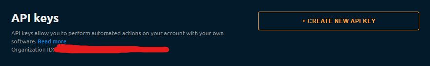
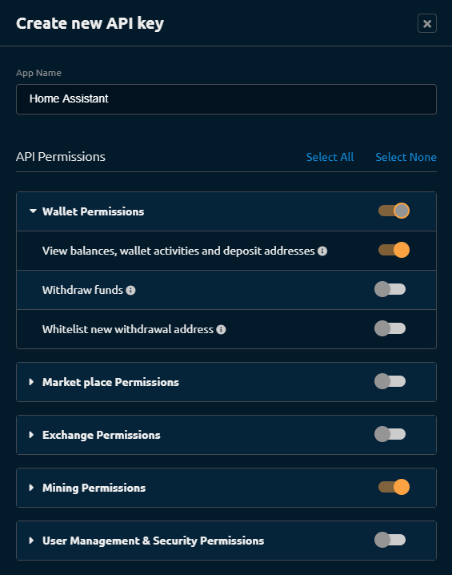
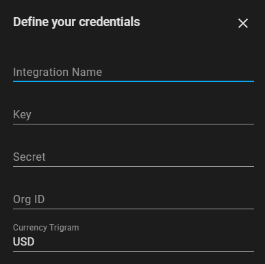

# NiceHash custom integration by @RomRider

This is a custom integration for [NiceHash](https://www.nicehash.com).

It will enable you to collect:
* Your accounts statistics
  * balance
  * profitability
  * local profitability
  * unpaid amount
* Your rigs statistics
  * Accepted Hash rate
  * Rejected Hash rate
  * Profitability
  * Local Profitability

All the values which represent a BTC amount generate 2 sensors:
* one in BTC
* one in the currency you selected during the setup (conversion rate if provided by NiceHash)

## Installation

### HACS (prefered)

1. Add this repository to HACS as an integration: https://github.com/RomRider/ha_nicehash
1. Install the integration
1. Restart your instance

### Manual

1. Copy the content of `custom_components/nicehash` into your `custom_components/nicehash folder`.
1. Restart your instance

## Enabling the integration

### Setup the API Key

You'll need to create an API key in NiceHash for this integration to work:
1. head over to your NiceHash account settings
1. Go into the API Keys menu
1. In this menu at the top, you'll find your Organisation ID which is required to later setup the integration in Home-Assistant

   

1. click `CREATE NEW API KEY`
1. This will present you with this popup:

   

1. :warning: Make sure you configure it like the above picture (**DO NOT ENABLE ANY OF THE OTHER SETTINGS**, this is at your own risk)
1. Click on `GENERATE API KEY`
1. This will give you 2 strings, note them down, you can't retrieve them later on:

   * The Key
   * The Secret

1. Validate the popup and enable the API Key (it will be through email)

### Setup Home Assistant

Once that is done, head over to Home-Assistant and add the integration from the integration menu:

1. Name: Give a name to your integration (it will also be used as part of some sensors)
1. Key and Secret: This is the key/secret you retrieved from the API Key creation
1. Org ID: This is the Organization ID
1. Currency Trigam: This is the trigram of the currency the BTC amount will be converted to (both sensors will exist, BTC and the selected currency)
1. You're all set :tada:

## Adding to your interface

It is best to use [apexcharts-card](https://github.com/RomRider/apexcharts-card) (more flexibility) or [mini-graph-card](https://github.com/kalkih/mini-graph-card) (less flexibility) to display the data from those sensors.

